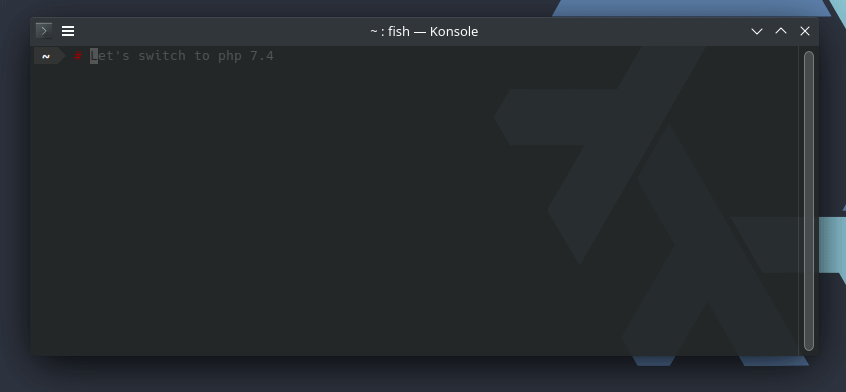

[![GitHub stars][github stars]][1]
 [![License][license]][1]
 [![Donate!][donate github]][5]

# Nix shell



## Description

This package provides a `Nix flake` ready to use
for PHP development, using the [`Nix` package manager][50]
which can be installed on (*almost*) any operating system.

Each available environment provides the following tools:

* PHP with extensions, `xdebug` and `pcov`,
* Custom `php.ini` loading,
* Composer,
* Git,
* Github CLi,
* Symfony CLi,
* GNU Make.

Available PHP versions from `5.6` to `8.1`.

The PHP extensions to use are automatically inferred
from the `composer.json` file.

## Usage

### In a shell

To work with `PHP 8.1` only:

```shell
nix develop github:loophp/nix-shell#php81
```
or

```shell
nix develop github:loophp/nix-shell#env-php81
```

`ZTS` is enabled by default (see [#154774](https://github.com/NixOS/nixpkgs/issues/154774)),
feel free to use the `NTS` if needed, see the matrix below.

Available PHP versions and environments are:

* `php56`, `php56-nts`, `php56-nodebug`, `php56-nts-nodebug`
* `env-php56`, `env-php56-nts`, `env-php56-nodebug`, `env-php56-nts-nodebug`
* `php70`, `php70-nts`, `php70-nodebug`, `php70-nts-nodebug`
* `env-php70`, `env-php70-nts`, `env-php70-nodebug`, `env-php70-nts-nodebug`
* `php71`, `php71-nts`, `php71-nodebug`, `php71-nts-nodebug`
* `env-php71`, `env-php71-nts`, `env-php71-nodebug`, `env-php71-nts-nodebug`
* `php72`, `php72-nts`, `php72-nodebug`, `php72-nts-nodebug`
* `env-php72`, `env-php72-nts`, `env-php72-nodebug`, `env-php72-nts-nodebug`
* `php73`, `php73-nts`, `php73-nodebug`, `php73-nts-nodebug`
* `env-php73`, `env-php73-nts`, `env-php73-nodebug`, `env-php73-nts-nodebug`
* `php74`, `php74-nts`, `php74-nodebug`, `php74-nts-nodebug`
* `env-php74`, `env-php74-nts`, `env-php74-nodebug`, `env-php74-nts-nodebug`
* `php80`, `php80-nts`, `php80-nodebug`, `php80-nts-nodebug`
* `env-php80`, `env-php80-nts`, `env-php80-nodebug`, `env-php80-nts-nodebug`
* `php81`, `php81-nts`, `php81-nodebug`, `php81-nts-nodebug`
* `env-php81`, `env-php81-nts`, `env-php81-nodebug`, `env-php81-nts-nodebug`

This package also provide development environments with some tools:

- Symfony cli
- Github cli
- sqlite
- git
- gnumake

In order to use them, use the prefix `env-`:

```shell
nix develop github:loophp/nix-shell#env-php81-nts-nodebug
```

### In another flake

Import the input:

```nix
  inputs = {
    nixpkgs.url = "github:NixOS/nixpkgs/nixos-unstable";
    flake-utils.url = "github:numtide/flake-utils";
    phps.url = "github:loophp/nix-shell";
  };
```

Then each PHP environment will be available at

```nix
    # PHP 8.1 Non-Thread-Safe only
    phps.packages.${system}.php81-nts
```

or

```nix
    # PHP 8.1 Non-Thread-Safe, no debug extension and some tools
    phps.packages.${system}.env-php81-nts-nodebug
```

### Customize PHP

To customize the PHP configuration, you can do it like this:

```shell
nix develop github:loophp/nix-shell#php81
php -c /path/to/the/config.ini <<command>>
```

Another option would be to create a `.php.ini` file within your
current working directory before running the PHP environment,
as such:

```ini
max_execution_time = 0
memory_limit = 2048M
```

Then run:


```shell
nix develop github:loophp/nix-shell#php81 --impure
```

The `--impure` flag is important to make sure that your custom
`.php.ini` file is correctly taken in account.

## Contributing

Feel free to contribute by sending pull requests. We are a
usually very responsive team and we will help you going
through your pull request from the beginning to the end.

For some reasons, if you can't contribute to the code and
willing to help, sponsoring is a good, sound and safe way
to show us some gratitude for the hours we invested in this
package.

Sponsor me on [Github][5] and/or any of [the contributors][6].

## Thanks

* [Jan Tojnar][47] for assisting me into incorporating his [own package][48].
* [Aaron Anderse][52] for improving the code and giving some tips.

## Changelog

See [CHANGELOG.md][43] for a changelog based on [git commits][44].

For more detailed changelogs, please check [the release changelogs][45].

[1]: https://packagist.org/packages/loophp/nix-shell
[latest stable version]: https://img.shields.io/packagist/v/loophp/nix-shell.svg?style=flat-square
[github stars]: https://img.shields.io/github/stars/loophp/nix-shell.svg?style=flat-square
[total downloads]: https://img.shields.io/packagist/dt/loophp/nix-shell.svg?style=flat-square
[github workflow status]: https://img.shields.io/github/workflow/status/loophp/nix-shell/Unit%20tests?style=flat-square
[code quality]: https://img.shields.io/scrutinizer/quality/g/loophp/nix-shell/master.svg?style=flat-square
[3]: https://scrutinizer-ci.com/g/loophp/nix-shell/?branch=master
[type coverage]: https://img.shields.io/badge/dynamic/json?style=flat-square&color=color&label=Type%20coverage&query=message&url=https%3A%2F%2Fshepherd.dev%2Fgithub%2Floophp%2Fcollection%2Fcoverage
[4]: https://shepherd.dev/github/loophp/nix-shell
[code coverage]: https://img.shields.io/scrutinizer/coverage/g/loophp/nix-shell/master.svg?style=flat-square
[license]: https://img.shields.io/packagist/l/loophp/nix-shell.svg?style=flat-square
[donate github]: https://img.shields.io/badge/Sponsor-Github-brightgreen.svg?style=flat-square
[donate paypal]: https://img.shields.io/badge/Sponsor-Paypal-brightgreen.svg?style=flat-square
[34]: https://github.com/loophp/nix-shell/issues
[2]: https://github.com/loophp/nix-shell/actions
[35]: http://www.phpspec.net/
[36]: https://github.com/phpro/grumphp
[37]: https://github.com/infection/infection
[38]: https://github.com/phpstan/phpstan
[39]: https://github.com/vimeo/psalm
[5]: https://github.com/sponsors/drupol
[6]: https://github.com/loophp/nix-shell/graphs/contributors
[43]: https://github.com/loophp/nix-shell/blob/master/CHANGELOG.md
[44]: https://github.com/loophp/nix-shell/commits/master
[45]: https://github.com/loophp/nix-shell/releases
[46]: https://nixos.org/guides/nix-pills/developing-with-nix-shell.html
[47]: https://github.com/jtojnar
[48]: https://github.com/fossar/nix-phps
[50]: https://nixos.org/download.html
[52]: https://github.com/aanderse